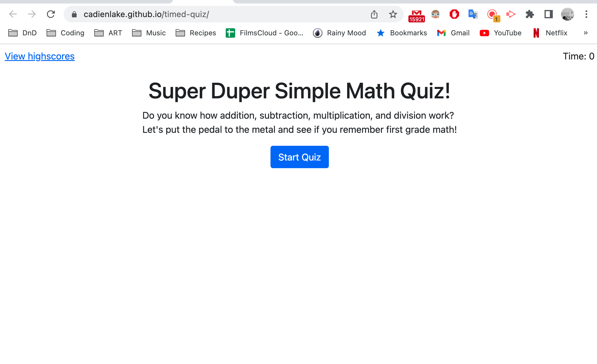

# CJames-Math-Quiz

> Live demo [_here_](https://cadienlake.github.io/timed-quiz/).

## Table of Contents

- [General Info](#general-information)
- [Screenshot](#screenshot)
- [Features](#features)
- [Project Status](#project-status)
- [Acknowledgements](#acknowledgements)

## General Information

-This is a timed quiz that generates questions and buttons in the html via javascript, verifies and displays if you've answered correctly after each answer, and prompts you to save your highscore upon completion.

## Screenshot

## Features

This quiz website includes

- Buttons to begin the game, view your highscore, submit answers, and submit your score
- A timer that is used as your score upon completion or which ends the game if it runs out

## Project Status

Project is: _finished_.

## Acknowledgements

- This project was created with assistance from our bootcamp instructor and student conversations. Thanks for the teamwork!
